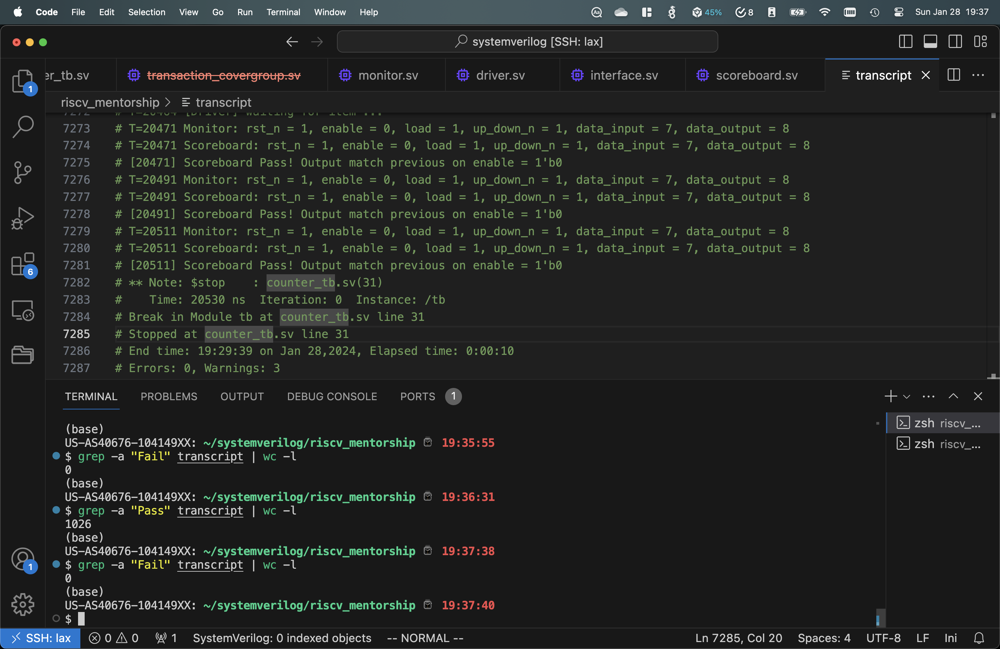
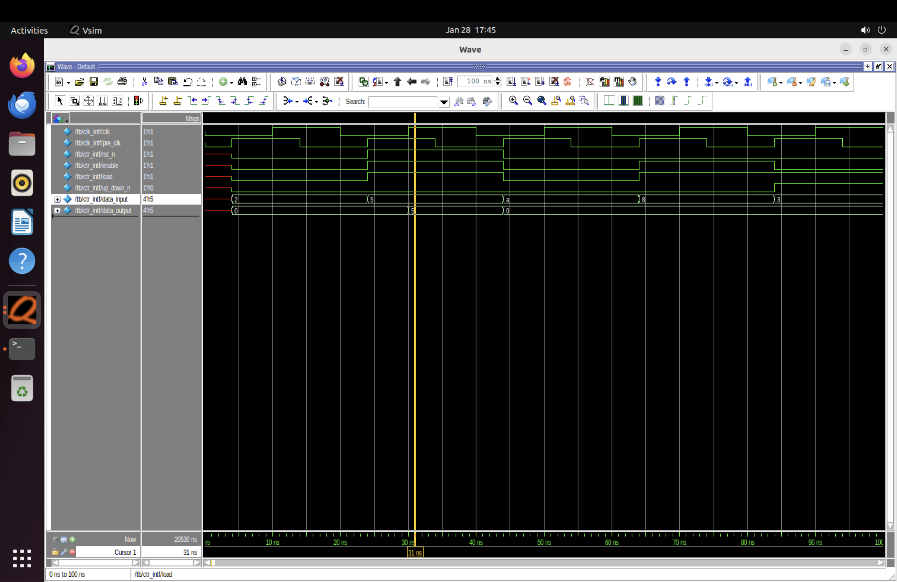
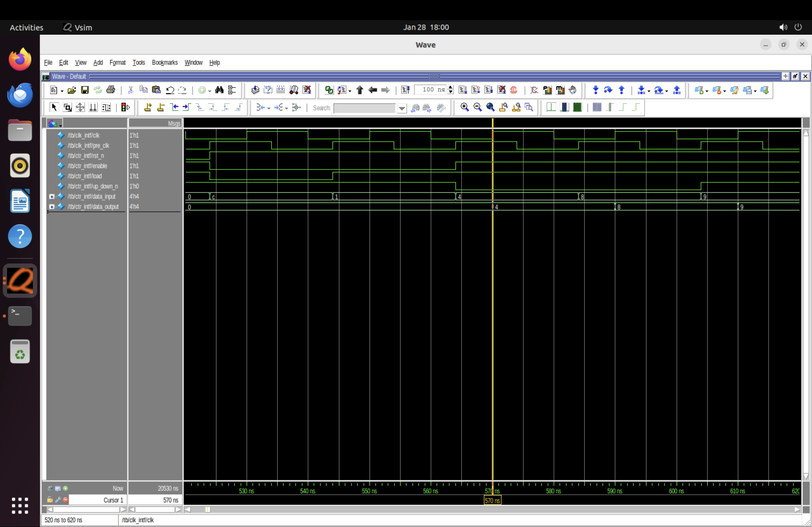
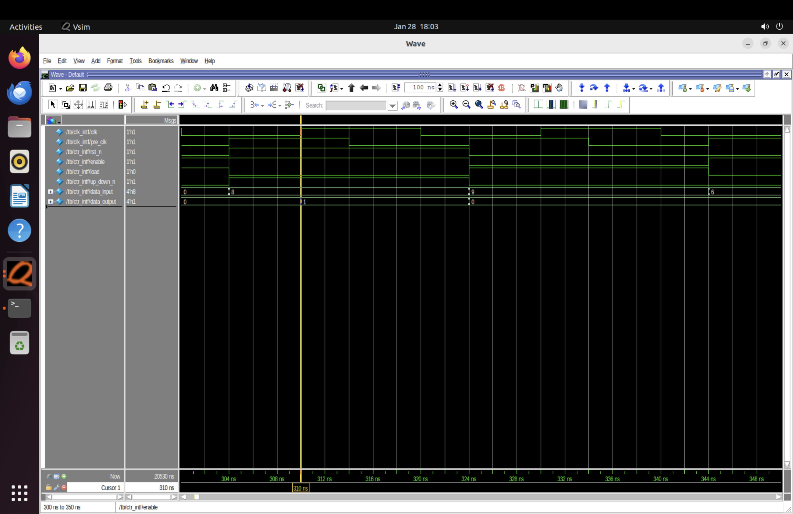

# Up/Down Counter

I wrote a counter that complies with the specification of counter and a constraint-based verification, whose generator randomly generates 1024 transactions. Although 1026 transactions will be on the scoreboard, the latter three transactions are the same due to #50 delay after the generator finishes generating.

[toc]

## Most Interesting Hardware and Software Projects

For hardware projects, I think the most exciting one is to implement the components for a OoO machine, in which we learned how the components work, read the partial-complete code for the components and implement it. As we are also programming it on a FPGA board, we implement the FRAT and RRAT with Copy-Free Checkpoint to make it FPGA friendly. In addition, my full-custom 512-bit SRAM Array design is also interesting as I have to draw layout and optimize the design from both cycle time and area.

Among software projects, compiler design and implementation during my undergrad is the most interesting one for me. After implementing parser, syntax analysis, semantic analysis immediate code generation and code generation, I gained insight about how a compiler works and how a compile programming language uses memory space for variables. And I have also implemented cryptography algorithms in Rust, including RSA, AES and SHA-3.

## Specification for Counter

Write a SystemVerilog module for a 4-bit synchronous up/down counter with 

-   enable
-   asynchronous reset
-   synchronous load
-   a testbench to verify your counter

## Folder Structure

DUT: counter.sv

Testbench:

- counter_tb.sv: testbench tb
- interface.sv: interfaces between DUT and driver and between DUT and monitor, and clock interface
- transaction.sv
- collector.sv: coverage group file, which is not working as I am still learning how to integrate covergroup to the design
- generator.sv
- driver.sv
- monitor.sv
- scoreboard.sv
- env_pkg.sv: a package including all the files in the environment
- test_pkg.sv: a package including all the files in the test
- environment.sv
- test.sv

QuestSIM

- run.do
- wave.do
- transcript

## Testbench Screenshot with QuestaSIM

>   Please refer to https://github.com/Karl-Han/up_down_counter for README

This is a demonstration of 1026 successful transactions and 0 failed transactions:

This is a demonstration of

-   synchrouns load on 30ns

-   asynchronoous reset on 44ns

This is a demonstration of synchronous load at 570ns, 590ns and 610ns

This is a demonstration of up counter:

